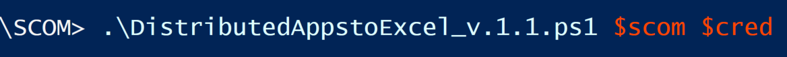
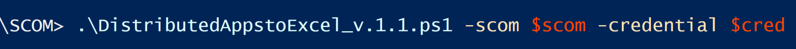
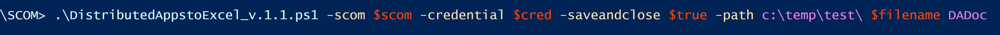
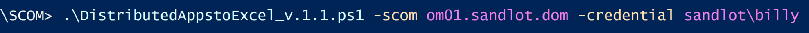
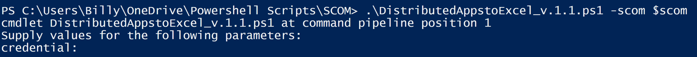
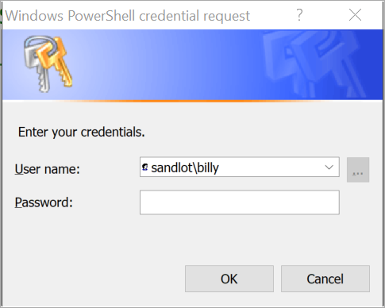
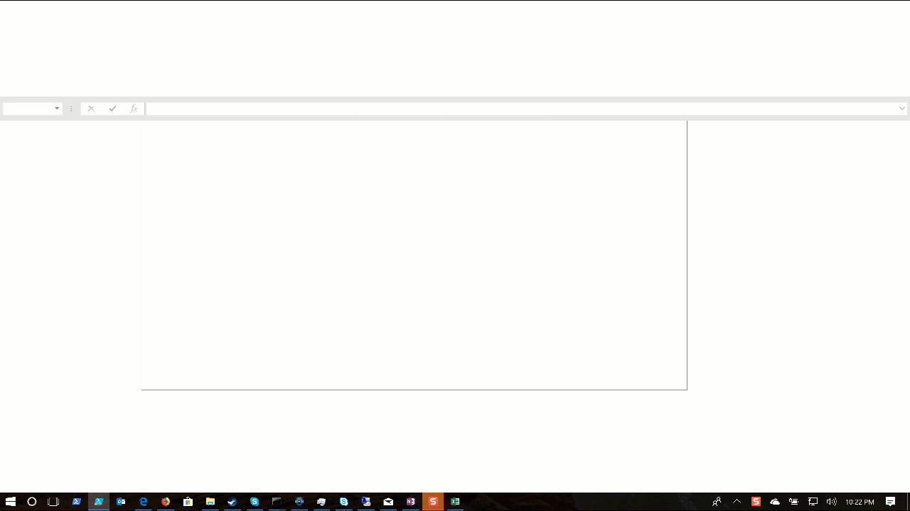
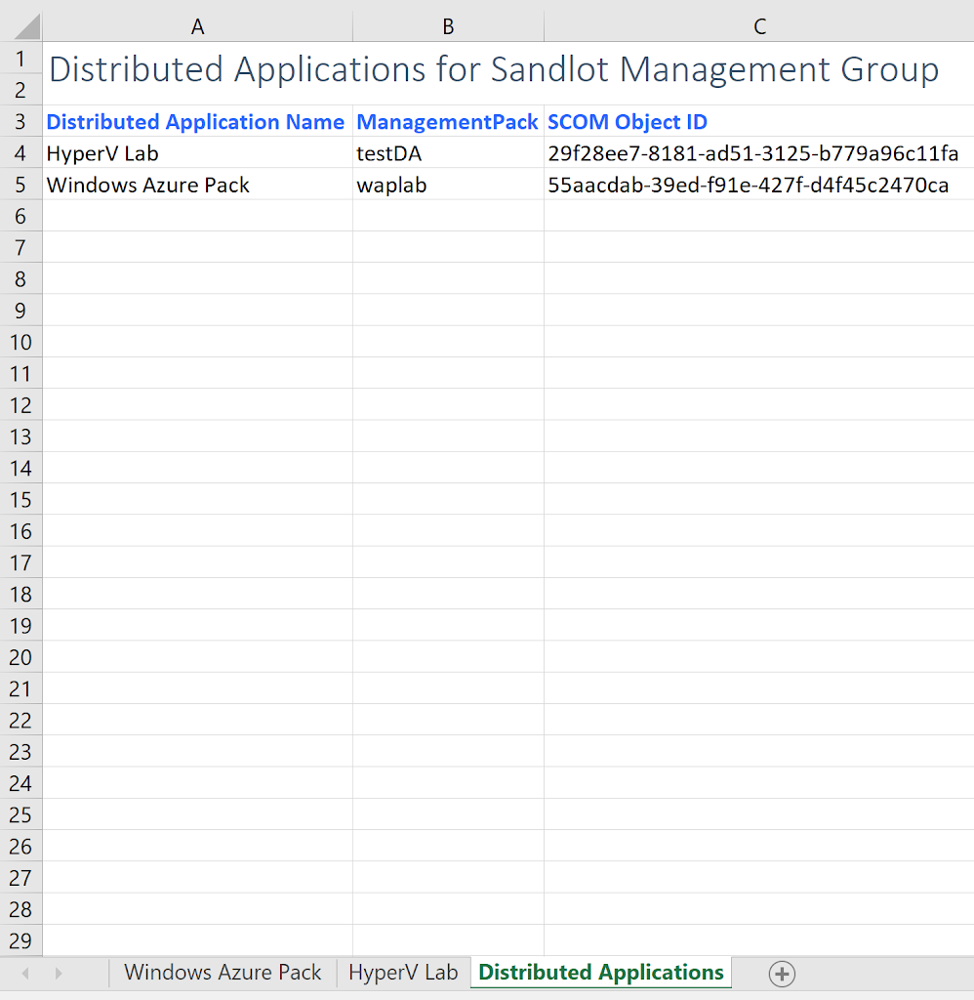
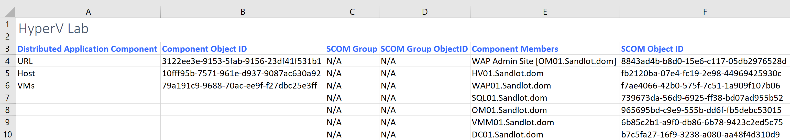
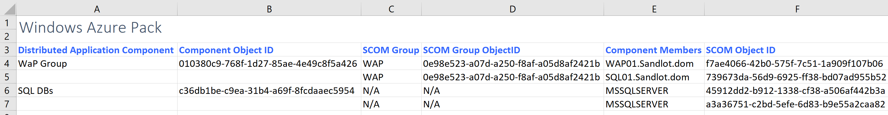

# Document SCOM Distributed Applications with Powershell

First, what this script is: A script that attempts to grab all your Distributed Applications, their components and objects in the DA components.

What it is not: a full SCOM environment documentation script.
Also if you have a SCOM Group inside a SCOM Group inside a DA Component, the script will only go one level deep on the first SCOM Group.

The script accepts parameters -scom and -credential, which are required.
The script will also accept optional parameters -saveandclose (boolean) -path (string) -filename (string). If you use the SaveandClose parameter you need to fill out the path and filename or it will fail to save.

All commands are executed remotely. Excel is obviously required. The account you specify needs to have remote Powershell access to the SCOM environment.

# How to Run the Script

Here are some examples of running the script with parameters

If you don’t specify credentials it will prompt for your credentials

# Example Lab Outputs

Here is example output from my SCOM Lab.

## GIF output

The main sheet where all Distributed Applications will be put with their Management Pack and SCOM Object ID.

## HyperV Lab

## Windows Azure Pack

# Testing Notes

The script has been tested in a production environment with approximately 88 distributed applications. In this instance the script took about 10 minutes to run.

Definitely test it in your lab first. Use at your own risk. The script does not modify any data in your environment, its only getting data. However, it will put load on your SDK service for each call it makes.

Tested on SCOM 2016 and 1801 and Excel 2016. It should work in SCOM 2012 R2, if you try it and it does work please let me know.

related blog post <https://www.systemcenterautomation.com/2018/02/document-your-scom-distributed-applications/>
